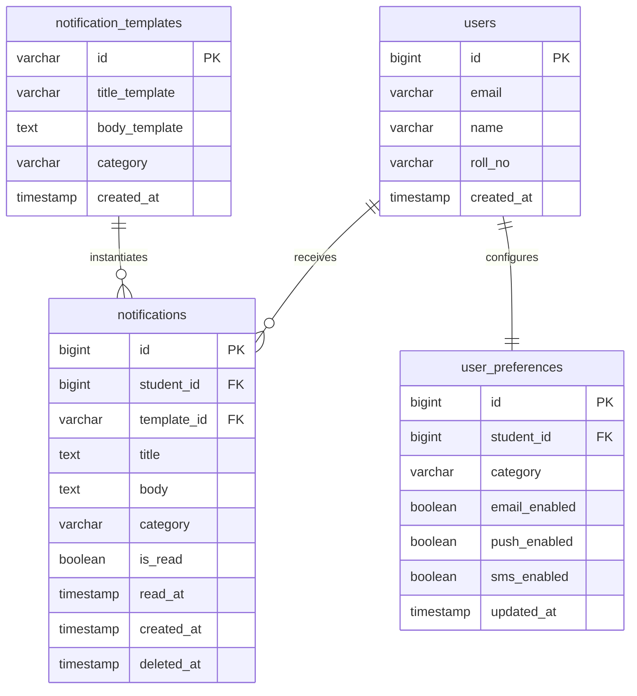

# Notification System Design

This document details the system design for a highly scalable, production-ready, and resilient notification platform capable of handling real-time push events, batch delivery, and multi-channel preferences for millions of users.

---

## Stage 1: API Contract & Architecture

To support core notifications, user preferences, and real-time streams, a structured and consistent RESTful API is established alongside a stateful WebSocket layer.

### 1. Request Headers

All incoming REST client requests must include the following headers for validation, security, and context:

```http
Content-Type: application/json
Authorization: Bearer <jwt_access_token>
X-Client-Version: 1.0.0
X-Request-ID: f81d4fae-7dec-11d0-a765-00a0c91e6bf6
```

---

### 2. REST API Endpoints

#### A. Send Notification (Trigger Broadcast/Direct)
* **Endpoint**: `POST /api/v1/notifications`
* **Description**: Enqueues a notification payload for delivery. Used by internal microservices or HR administrators.
* **Request Body**:
```json
{
  "templateId": "tmpl_placement_notice_2026",
  "recipientIds": [1042, 1043],
  "channels": ["push", "email"],
  "variables": {
    "studentName": "Rahul Pandey",
    "companyName": "Google",
    "interviewDate": "2026-06-15"
  },
  "priority": "HIGH"
}
```
* **Success Response (`202 Accepted`)**:
```json
{
  "success": true,
  "message": "Notification batch successfully accepted and enqueued",
  "batchId": "batch_987654321_abc",
  "enqueuedCount": 2,
  "timestamp": "2026-06-10T12:35:00Z"
}
```
* **Error Response (`400 Bad Request`)**:
```json
{
  "error": "VALIDATION_FAILED",
  "message": "Invalid recipient IDs provided or unsupported channels requested",
  "details": [
    {
      "field": "channels",
      "issue": "Channel 'sms' is temporarily disabled"
    }
  ]
}
```

#### B. Fetch Notification Feed (with Cursor Pagination)
* **Endpoint**: `GET /api/v1/notifications`
* **Description**: Retrieves a paginated list of notifications for the authenticated student.
* **Query Parameters**:
  * `limit` (optional, default: 20, max: 100): Number of notifications to fetch.
  * `startingAfter` (optional): Cursor pointing to the last evaluated notification ID from the previous page.
  * `isRead` (optional): Filter by read/unread status.
* **Success Response (`200 OK`)**:
```json
{
  "success": true,
  "data": [
    {
      "id": "notif_01H2X6Z8Y9A",
      "title": "New Placement Drive",
      "body": "Hi Rahul, Google is hosting an interview drive on 2026-06-15.",
      "category": "Placement",
      "isRead": false,
      "createdAt": "2026-06-10T12:00:00Z",
      "readAt": null
    },
    {
      "id": "notif_01H2X6Z8Y9B",
      "title": "Library Book Due",
      "body": "Please return 'Clean Architecture' by tomorrow.",
      "category": "Academic",
      "isRead": true,
      "createdAt": "2026-06-08T09:30:00Z",
      "readAt": "2026-06-08T10:15:00Z"
    }
  ],
  "pagination": {
    "limit": 2,
    "hasMore": true,
    "nextCursor": "notif_01H2X6Z8Y9B"
  }
}
```

#### C. Mark Notification as Read (Single)
* **Endpoint**: `PATCH /api/v1/notifications/:id/read`
* **Description**: Marks a specific notification as read.
* **Success Response (`200 OK`)**:
```json
{
  "success": true,
  "notificationId": "notif_01H2X6Z8Y9A",
  "isRead": true,
  "readAt": "2026-06-10T12:36:10Z"
}
```

#### D. Bulk Mark Notifications as Read
* **Endpoint**: `PATCH /api/v1/notifications/read`
* **Description**: Marks multiple notifications as read.
* **Request Body**:
```json
{
  "notificationIds": ["notif_01H2X6Z8Y9A", "notif_01H2X6Z8Y9C"]
}
```
* **Success Response (`200 OK`)**:
```json
{
  "success": true,
  "markedCount": 2,
  "status": "READ"
}
```

#### E. Delete Notification
* **Endpoint**: `DELETE /api/v1/notifications/:id`
* **Description**: Soft-deletes a notification from the user's feed.
* **Success Response (`200 OK`)**:
```json
{
  "success": true,
  "notificationId": "notif_01H2X6Z8Y9A",
  "status": "DELETED"
}
```

#### F. Fetch User Notification Preferences
* **Endpoint**: `GET /api/v1/users/preferences`
* **Description**: Retrieves channels opted-in/opted-out by the user for different categories.
* **Success Response (`200 OK`)**:
```json
{
  "success": true,
  "userId": 1042,
  "preferences": [
    {
      "category": "Placement",
      "email": true,
      "push": true,
      "sms": false
    },
    {
      "category": "Academic",
      "email": true,
      "push": false,
      "sms": false
    }
  ]
}
```

#### G. Update User Notification Preferences
* **Endpoint**: `PUT /api/v1/users/preferences`
* **Description**: Updates user notification channel preferences.
* **Request Body**:
```json
{
  "preferences": [
    {
      "category": "Placement",
      "email": true,
      "push": true,
      "sms": true
    }
  ]
}
```
* **Success Response (`200 OK`)**:
```json
{
  "success": true,
  "message": "Preferences updated successfully"
}
```

---

### 3. Real-Time Notification Architecture (WebSocket Protocol)

To minimize connection overhead and eliminate expensive polling, a persistent WebSocket connection is maintained.

```
+---------------+           WS Handshake            +------------------+
|               | --------------------------------> |                  |
|               |      JWT Authorization Check      |                  |
|  Client App   | <-------------------------------- |  WebSocket Gate  |
| (FE Listener) |         WS Connection Est.        |    (API Gate)    |
|               |                                   |                  |
|               | <================================ |                  |
|               |     Real-Time Pushed Payload      |                  |
+---------------+                                   +------------------+
```

#### Connection Handshake
* **WebSocket URL**: `wss://notifications.platform.com/ws/connect?token=<jwt_access_token>`
* **Sub-Protocol**: `graphql-ws` or custom `notification-v1`

#### Connection Lifecycle & Heartbeats
* **Heartbeat interval**: 30 seconds.
* **Client Ping**: `{ "type": "ping" }`
* **Server Pong**: `{ "type": "pong" }`
* **Idle Timeout**: Connections with no activity for 65 seconds are terminated.

#### Real-Time Delivery Frame Payload
When an event triggers while a client is online, the Gateway pushes the following structured payload frame:
```json
{
  "event": "NOTIFICATION_RECEIVED",
  "timestamp": "2026-06-10T12:35:45Z",
  "data": {
    "id": "notif_01H2X6Z8Y9A",
    "title": "Immediate Action: Google Placement Drive",
    "body": "Rahul, please upload your resume for Google by 5 PM.",
    "category": "Placement",
    "priority": "HIGH",
    "isRead": false,
    "metadata": {
      "deadline": "2026-06-10T17:00:00Z"
    }
  }
}
```

---

## Stage 2: Database Schema & Scaling Strategy

### 1. Database Selection & Justification

A hybrid storage strategy is chosen for this production environment:
1. **Primary Database**: **PostgreSQL** (Relational Database)
   * **ACID Transactions**: Critical for updating user preferences, logging delivery status, and guaranteeing consistency in auditable communication records.
   * **JSONB Capabilities**: Efficient indexing and querying of schema-less rich notification metadata (e.g., specific event variables, deep-link routing attributes).
   * **Relational Integrity**: Strict foreign keys guarantee that notifications map to valid users and templates.
2. **Caching & Connection Mapping Layer**: **Redis** (In-Memory Data Store)
   * Real-time WebSocket connection-to-user maps, unread counts caching, and high-frequency pub/sub logging.

---

### 2. SQL Schema DDL Design

The database layout consists of four optimized tables:



```sql
-- Core Student/User Table
CREATE TABLE users (
    id BIGSERIAL PRIMARY KEY,
    email VARCHAR(255) UNIQUE NOT NULL,
    name VARCHAR(255) NOT NULL,
    roll_no VARCHAR(50) UNIQUE NOT NULL,
    created_at TIMESTAMP WITH TIME ZONE DEFAULT CURRENT_TIMESTAMP NOT NULL
);

-- Reusable Notification Templates
CREATE TABLE notification_templates (
    id VARCHAR(100) PRIMARY KEY,
    title_template VARCHAR(255) NOT NULL,
    body_template TEXT NOT NULL,
    category VARCHAR(50) NOT NULL,
    created_at TIMESTAMP WITH TIME ZONE DEFAULT CURRENT_TIMESTAMP NOT NULL
);

-- Main Notifications Table
CREATE TABLE notifications (
    id BIGSERIAL PRIMARY KEY,
    student_id BIGINT REFERENCES users(id) ON DELETE CASCADE NOT NULL,
    template_id VARCHAR(100) REFERENCES notification_templates(id) ON DELETE SET NULL,
    title TEXT NOT NULL,
    body TEXT NOT NULL,
    category VARCHAR(50) NOT NULL,
    is_read BOOLEAN DEFAULT FALSE NOT NULL,
    read_at TIMESTAMP WITH TIME ZONE,
    created_at TIMESTAMP WITH TIME ZONE DEFAULT CURRENT_TIMESTAMP NOT NULL,
    deleted_at TIMESTAMP WITH TIME ZONE
);

-- Notification Channel Preferences Table
CREATE TABLE user_preferences (
    id BIGSERIAL PRIMARY KEY,
    student_id BIGINT REFERENCES users(id) ON DELETE CASCADE NOT NULL,
    category VARCHAR(50) NOT NULL,
    email_enabled BOOLEAN DEFAULT TRUE NOT NULL,
    push_enabled BOOLEAN DEFAULT TRUE NOT NULL,
    sms_enabled BOOLEAN DEFAULT FALSE NOT NULL,
    updated_at TIMESTAMP WITH TIME ZONE DEFAULT CURRENT_TIMESTAMP NOT NULL,
    CONSTRAINT uq_student_category UNIQUE (student_id, category)
);

-- Indexes for Fast Retrievals
CREATE INDEX idx_notifications_student_feed ON notifications(student_id, is_read, created_at DESC) 
WHERE deleted_at IS NULL;

CREATE INDEX idx_user_preferences_lookup ON user_preferences(student_id, category);
```

---

### 3. CRUD Queries for Stage 1 APIs

#### Create/Enqueue Notification Record
```sql
INSERT INTO notifications (student_id, template_id, title, body, category)
VALUES (1042, 'tmpl_placement_notice_2026', 'New Placement Drive', 'Hi Rahul, Google is hosting a drive.', 'Placement');
```

#### Fetch Notification Feed (With Seek Pagination filtering cursor `last_id` & `last_created_at`)
```sql
SELECT id, title, body, category, is_read, created_at, read_at
FROM notifications
WHERE student_id = 1042
  AND deleted_at IS NULL
  AND (created_at < :last_created_at OR (created_at = :last_created_at AND id < :last_id))
ORDER BY created_at DESC, id DESC
LIMIT 20;
```

#### Mark a Notification as Read
```sql
UPDATE notifications
SET is_read = TRUE,
    read_at = CURRENT_TIMESTAMP
WHERE id = 12345
  AND student_id = 1042
  AND is_read = FALSE;
```

#### Soft Delete a Notification
```sql
UPDATE notifications
SET deleted_at = CURRENT_TIMESTAMP
WHERE id = 12345
  AND student_id = 1042;
```

#### Upsert User Notification Preferences
```sql
INSERT INTO user_preferences (student_id, category, email_enabled, push_enabled, sms_enabled, updated_at)
VALUES (1042, 'Placement', TRUE, TRUE, TRUE, CURRENT_TIMESTAMP)
ON CONFLICT (student_id, category)
DO UPDATE SET 
    email_enabled = EXCLUDED.email_enabled,
    push_enabled = EXCLUDED.push_enabled,
    sms_enabled = EXCLUDED.sms_enabled,
    updated_at = CURRENT_TIMESTAMP;
```

---

### 4. Database Scaling & Architecture Strategy

When the platform scales to millions of users, single-node PostgreSQL databases hit bottlenecks. The following patterns resolve scaling issues:

#### A. Replication (Primary-Replica)
* Write-heavy traffic is routed to a single, high-spec **Primary PostgreSQL** instance.
* Heavy read operations (such as loading notification lists or calculating unread metrics) are distributed across multiple **Read Replicas** via connection poolers (e.g., PgBouncer). 
* Asynchronous streaming replication synchronizes replicas with a sub-second lag.

#### B. Indexing Strategy
* Keep index sizes small to ensure they fit in memory (RAM).
* Avoid individual indexes on low-cardinality fields like `is_read`. Instead, use **Partial Indexes** (e.g., indexing only rows `WHERE deleted_at IS NULL` or `WHERE is_read = FALSE`) to speed up search lookups.

#### C. Horizontal Partitioning
* Partition the `notifications` table dynamically using PostgreSQL Declarative Partitioning by **Range (Time)** (e.g., monthly partitions).
* Old partitions (older than 6 months) can be detached and archived into cheaper cold compressed object storage (e.g., CSV on S3 Glacier), keeping the primary active table small, fast, and cached in memory.

#### D. Sharding
* Scale horizontally across physical database clusters by sharding the data on a **Shard Key** like `student_id`.
* All records (notifications, preferences) for a given student sit on the same physical shard database node. This avoids cross-node joins and allows linear read/write scaling.

#### E. Backup Strategy
* **Physical Backup**: Continuous WAL archiving combined with daily physical base backups (using tools like `pgBackRest` or `Barman`) sent to S3 with a lifecycle policy. This enables **Point-in-Time Recovery (PITR)** down to the exact second.
* **Logical Backup**: Regular compressed schema and template snapshots (`pg_dump`) to recreate specific configurations quickly.

---

## Stage 3: Query Optimization Analysis

### 1. Given Query & Correctness
```sql
SELECT *
FROM notifications
WHERE studentID = 1042
AND isRead = false
ORDER BY createdAt ASC;
```

**Correctness Evaluation**:
The query is syntactically accurate. It returns all unread notifications for a specific student, sorted in chronological order. However, using `SELECT *` in production is a bad practice as it transfers unnecessary metadata columns (e.g., template structures, logs) over the network, causing increased I/O.

---

### 2. Bottlenecks at 5 Million Rows

Without an index, the database engine must execute a **Sequential Scan** across all 5 million rows to find matches for `studentID = 1042` and `isRead = false`.
* **Sequential Disk I/O**: The database reads every page of the table from disk into memory.
* **Sorting Overhead**: The database gathers the matching rows and performs an in-memory `Quick Sort` or an on-disk `External Merge Sort` to order them by `createdAt`. This consumes CPU and disk space.

---

### 3. Computational Complexity Analysis
* **Without Index**:
  * Filtering: $O(N)$ where $N = 5,000,000$.
  * Sorting: $O(M \log M)$ where $M$ is the number of matching rows.
  * Total Complexity: $O(N + M \log M)$
* **With Optimal Composite Index**:
  * Filtering & Sorting: $O(\log N + K)$ where $K$ is the number of matching unread rows. The sorting is pre-computed by the index structure.
  * Total Complexity: $O(\log N + K)$

---

### 4. Optimized Query

```sql
SELECT id, title, body, category, created_at
FROM notifications
WHERE student_id = 1042
  AND is_read = FALSE
  AND deleted_at IS NULL
ORDER BY created_at ASC
LIMIT 50;
```

---

### 5. Composite Index Selection & Optimization

#### The Dangers of Indexing Every Column Individually
Creating independent B-Tree indexes on `student_id`, `is_read`, and `created_at` degrades performance:
1. **Write Overhead**: Every `INSERT`, `UPDATE`, or `DELETE` requires updating multiple indexes, causing write operations to slow down.
2. **Disk and Cache Bloat**: Multiple indexes consume memory, crowding out the database's working dataset.
3. **Bitmap Merge Join Overhead**: The query planner must retrieve row pointer bitmaps from individual indexes and perform bitmap intersection operations, which is slower than reading from a single composite index.

#### Optimal Composite Index Design
```sql
CREATE INDEX idx_notifications_optimization
ON notifications (student_id, is_read, created_at ASC)
WHERE deleted_at IS NULL;
```

#### Rationale for Order of Columns
According to the **Leftmost Prefix Rule**:
1. **`student_id` (First)**: High-cardinality equality filter. Narrows down millions of records to a small subset for a single student.
2. **`is_read` (Second)**: Low-cardinality equality filter. Further narrows down the subset.
3. **`created_at` (Third)**: Range/Sorting column. Placing it last in the composite index allows the engine to fetch pre-sorted results without needing a separate sorting step.

---

### 6. Placement Notifications Query (Last 7 Days)

To retrieve students who received 'Placement' category notifications in the last 7 days:

```sql
SELECT DISTINCT student_id
FROM notifications
WHERE category = 'Placement'
  AND created_at >= NOW() - INTERVAL '7 days'
  AND deleted_at IS NULL;
```

#### Execution Plan Improvements
* **Before optimization**: A `Sequential Scan` on the entire table with a filter on `category` and `created_at`.
* **After optimization**: Applying a composite index on `(category, created_at)` reduces the operation to an `Index Link Scan` or `Index Only Scan`. The query engine performs a rapid B-Tree search directly to the timestamp range, ignoring the rest of the table.

---

## Stage 4: Caching & Feed Delivery Strategy

```
+----------+              Get Feed             +---------------+
|          | --------------------------------> |               |
|          |                                   |  API Gateway  |
|          | <-------------------------------- |               |
|  Client  |          Caches Hit / Response    +---------------+
|          |                                     |           |
|          | <============= WS Push Event ===    |           | Cache Miss
|          |                                   V           V
+----------+                               +-------+   +------------+
                                           | Redis |   | PostgreSQL |
                                           +-------+   +------------+
```

### 1. Bottlenecks of Fetch-on-Load
* **Connection Exhaustion**: High concurrent traffic spike (e.g., during exam results) causes connection pool exhaustion at the database layer.
* **Redundant Calculations**: Fetching identical unread lists on every page load consumes database CPU and disk I/O.
* **Latency**: Fetching notifications directly from disk increases response times.

---

### 2. Cache-Aside Caching Strategy (Redis Architecture)

To reduce database load, notifications are cached in Redis.

#### Redis Sorted Set (ZSET) Structure
* **Key**: `student:feed:<student_id>`
* **Member**: Stringified JSON payload or Notification ID.
* **Score**: Timestamp of the notification (`created_at` in epoch milliseconds).
* **Capped Size**: Cache only the most recent 100 notifications. Old notifications are evicted dynamically using:
  `ZREMRANGEBYRANK student:feed:<student_id> 0 -101`

#### Unread Counts String Cache
* **Key**: `student:unread_count:<student_id>`
* **Value**: Integer counter. Incremented on new notifications and decremented when a notification is marked read.

---

### 3. API Optimization Patterns

#### Keyset Pagination (Cursor) vs Offset Pagination
* **Offset Pagination (`OFFSET 100000`)**: The database must scan and discard `100,000` rows before returning the next 20 results. This degrades performance as users scroll deeper.
* **Keyset Pagination (`WHERE created_at < :cursor`)**: The database looks up the cursor value using the composite index and fetches the next 20 rows immediately, maintaining constant execution time $O(\log N)$ at any depth.

#### Lazy Loading
* Fetch only high-level notification details (ID, Title, Category, Status) in the primary feed. 
* Detail payloads (like deep-link details and variables) are loaded lazily from the database only when the user clicks a notification to open it.

---

### 4. Push vs Pull Model Tradeoffs

| Architecture | Implementation | Latency | Server Resource Cost | Database Load | Tradeoffs |
| :--- | :--- | :--- | :--- | :--- | :--- |
| **Short Polling (Pull)** | Client requests updates every 10s via HTTP GET. | High (up to 10s delay). | Low memory, high connection setup churn. | Very High (constant query hits). | Simple to implement, but wastes server resources and scales poorly. |
| **Long Polling (Pull)** | Server holds request open until a new message is available. | Low (immediate push). | High thread/connection reservation count. | Medium. | Handles connection drops gracefully, but holds server threads open. |
| **WebSockets (Push)** | Persistent full-duplex TCP socket. | Extremely Low (< 50ms). | Stateful server memory (10-15KB per connection). | Extremely Low (reads from cache on connection only). | Real-time and efficient, but requires stateful load balancing and connection recovery handling. |
| **SSE (Push)** | Uni-directional HTTP connection stream. | Extremely Low. | Low memory (standard HTTP). | Low. | Easy to set up over HTTP/2, but limited to text data and does not support full-duplex communication. |

---

## Stage 5: High-Throughput Notification Broadcast

### 1. Naive Loop Execution Failures
The following naive implementation causes major failures at scale:
```python
# Naive execution loop
def notify_all():
    students = db.get_all_students() # 50,000 records
    for student in students:
        send_email(student.email)
        save_to_db(student.id)
        push_to_app(student.id)
```

#### Crucial Failure Points
1. **Blocking Call Latency**: If sending a single email takes 500ms, processing 50,000 students sequentially will take **~7 hours**, blocking execution.
2. **Connection and Memory Exhaustion**: Loading 50,000 user objects into memory can trigger Out-Of-Memory (OOM) errors. Holding active database transactions open during HTTP requests causes connection starvation.
3. **No Error Isolation**: If the loop crashes at user 20,000 (e.g., due to an invalid email or connection drop), the execution halts, leaving the remaining 30,000 students without notifications.
4. **Duplicate Deliveries**: Restarting a crashed loop from the beginning resends duplicate notifications to users who already received them.

---

### 2. Scalable Message-Broker Architecture (Kafka/RabbitMQ)

To handle high-throughput broadcasts, the system decouples database updates from external delivery services using a message queue.

```
                  +-------------------+
                  |  Broadcast API    |
                  |  (Publisher)      |
                  +-------------------+
                            |
                            | Publishes jobs
                            V
                  +-------------------+
                  |   RabbitMQ/Kafka  | (Message Broker Exchange)
                  +-------------------+
                     /              \
         Dispatch   /                \   Dispatch
                   V                  V
         +------------+            +------------+
         | DB Worker  |            | Msg Worker |
         | (Consumer) |            | (Consumer) |
         +------------+            +------------+
               |                         |
               V (Writes)                |
         +------------+                  | (SMTP / WebSockets)
         | PostgreSQL |                  V
         +------------+            +------------+
                                   | Recipient  |
                                   +------------+
```

#### Broker Exchange & Queue Setup
1. **Exchange (`notification.exchange`)**: Fanout or Topic exchange that routes broadcast tasks.
2. **Queues**:
   * `db.persist.queue`: Dedicated to database writes.
   * `push.delivery.queue`: Dedicated to WebSocket push deliveries.
   * `email.delivery.queue`: Dedicated to SMTP/Third-party email API dispatches.
3. **Dead-Letter Exchange (DLX)**: Failed messages are routed to a retry queue with exponential backoff (`3s`, `9s`, `27s`). If it fails after 3 retries, the message is moved to a dead-letter queue (DLQ) for alerting and manual intervention.

---

### 3. Worker Design & Idempotency Guarantee

* **De-coupled Workers**: Separate worker pools consume from separate queues. A slow SMTP server will only delay the email queue, leaving the DB write queue and real-time push queue unaffected.
* **Idempotency Check**: To prevent sending duplicate notifications during network retries, the system generates a unique **Deduplication Key**:
  `dedup_key = sha256(template_id + student_id + broadcast_timestamp)`
* Prior to processing, the worker runs a `SETNX` command in Redis:
  `SETNX dedup_key:lock "processing" EX 86400`
  If the key already exists, the worker discards the duplicate message.

---

### 4. Scalable Revised Pseudocode

This scalable design uses a message broker to decouple tasks, processes data in batches, and includes error recovery and deduplication.

#### Publisher (Broadcast Initiator API)
```python
import hashlib
import json
import rabbitmq_client

def broadcast_notification(template_id, category, variables):
    # Fetch student list in batches using cursor streaming to prevent memory pressure
    limit = 1000
    last_id = 0
    
    broadcast_timestamp = get_current_iso_timestamp()
    
    while True:
        students = db.query(
            "SELECT id, email FROM users WHERE id > :last_id ORDER BY id ASC LIMIT :limit",
            last_id=last_id, limit=limit
        )
        if not students:
            break
            
        for student in students:
            # Generate unique idempotency key
            raw_key = f"{template_id}_{student.id}_{broadcast_timestamp}"
            dedup_key = hashlib.sha256(raw_key.encode('utf-8')).hexdigest()
            
            payload = {
                "student_id": student.id,
                "email": student.email,
                "template_id": template_id,
                "category": category,
                "variables": variables,
                "dedup_key": dedup_key,
                "timestamp": broadcast_timestamp
            }
            
            # Publish to message broker exchange
            rabbitmq_client.publish(
                exchange="notification.exchange",
                routing_key="notification.broadcast",
                body=json.dumps(payload)
            )
            
            last_id = student.id
```

#### Consumer Worker (Email Dispatcher)
```python
import redis
import email_provider

redis_client = redis.Redis(host='localhost', port=6379)

def on_message_received(channel, method, properties, body):
    payload = json.loads(body)
    dedup_key = payload["dedup_key"]
    
    # 1. Distributed lock / Idempotency check
    is_unique = redis_client.set(f"notif_lock:{dedup_key}", "locked", ex=86400, nx=True)
    if not is_unique:
        # Acknowledge and drop duplicate message
        channel.basic_ack(delivery_tag=method.delivery_tag)
        return
        
    try:
        # 2. Dispatch email to recipient
        email_provider.send_email(
            to=payload["email"],
            template=payload["template_id"],
            data=payload["variables"]
        )
        
        # 3. Acknowledge successful delivery
        channel.basic_ack(delivery_tag=method.delivery_tag)
        
    except Exception as exc:
        # Log failure and trigger retry workflow
        log_error(f"Failed to dispatch email for {payload['student_id']}: {str(exc)}")
        
        # Release the idempotency lock so the retried message can run
        redis_client.delete(f"notif_lock:{dedup_key}")
        
        # Reject the message and route to retry queue (with exponential backoff)
        channel.basic_nack(delivery_tag=method.delivery_tag, requeue=False)
```
